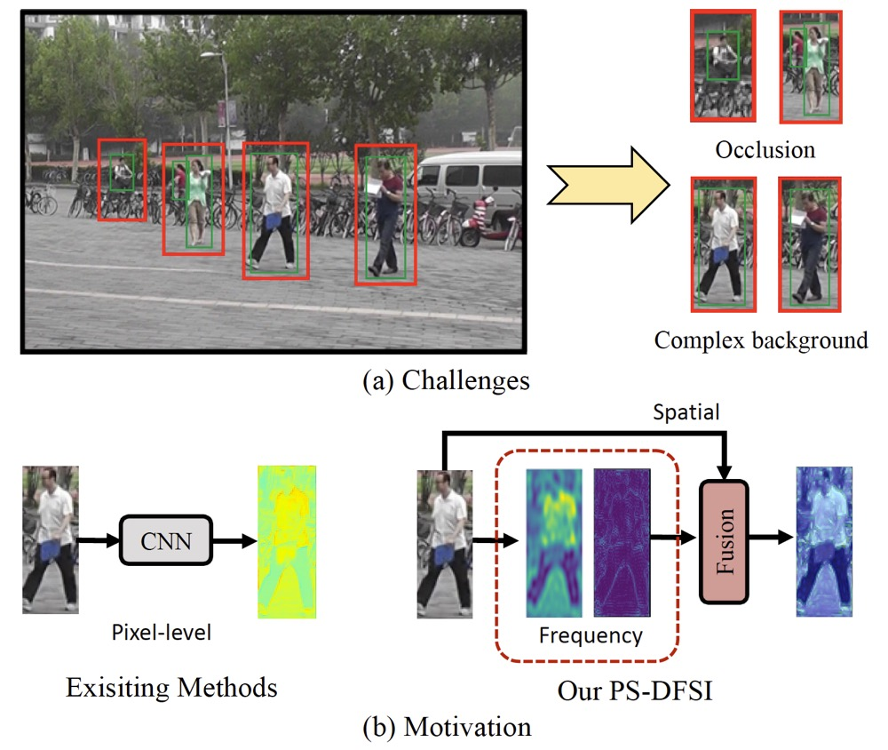
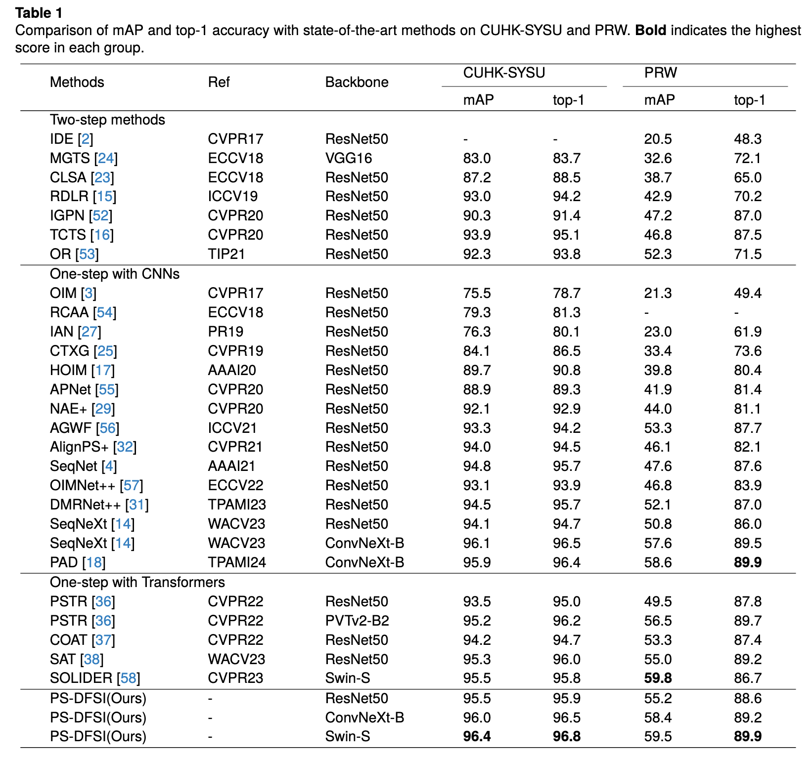

## ↳ Stargazers
[](https://github.com/zqx951102/ASTD/stargazers)
## ↳ Forkers
[](https://github.com/zqx951102/ASTD/network/members)


[](https://opensource.org/licenses/MIT)

<div align="center">

</div>

This repository hosts the source code of our paper: [DFSI]((https://github.com/zqx951102/DFSI)). 


Challenges and Motivation:
<div align="center">

</div>


The network structure:

<div align="center">

</div>


****
## :fire: NEWS :fire:

- [03/2025] **📣We submitted our paper to Information Fusion!**
  
- [02/2025] **📣We released the code.**


## Installation

Run `pip install -r requirements.txt` in the root directory of the project.


## Quick Start

Let's say `$ROOT` is the root directory.

1. Download [CUHK-SYSU](https://drive.google.com/open?id=1z3LsFrJTUeEX3-XjSEJMOBrslxD2T5af) and [PRW](https://drive.google.com/file/d/1Pz81MP8ePlNZMLm_P-AIkUERyOAXWOTV/view?usp=sharing) datasets, and unzip them to `$ROOT/data`

```
data
├── CUHK-SYSU
├── PRW
```

2. Following the link in the above table, download our pretrained model to anywhere you like, e.g., `$ROOT/exp_cuhk`

Performance profile:

| Dataset   | Name          | ASTD                                                        |
| --------- | ------------- | ------------------------------------------------------------ |
| CUHK-SYSU | epoch_12.pth  | [model](https://drive.google.com/file/d/16MQbaucjzKeXuadtVqTsZ0j0nQeG-q7M/view?usp=drive_link)|
| PRW       | epoch_13.pth  | [model](https://drive.google.com/file/d/1bXAGV7XGDuDatqx1VM6uJ28hWG-AOuhJ/view?usp=drive_link) |


Please see the Demo photo:

<div align="center">

</div>


**Note**: At present, our script only supports single GPU training, but distributed training will be also supported in future. By default, the batch size and the learning rate during training are set to 3 and 0.003 respectively, which requires about 28GB of GPU memory. If your GPU cannot provide the required memory, try smaller batch size and learning rate (*performance may degrade*). Specifically, your setting should follow the [*Linear Scaling Rule*](https://arxiv.org/abs/1706.02677): When the minibatch size is multiplied by k, multiply the learning rate by k. For example:


## Training
```
CUHK:
CUDA_VISIBLE_DEVICES=0 python train.py --cfg configs/cuhk_sysu_resnet.yaml
CUDA_VISIBLE_DEVICES=0 python train.py --cfg configs/cuhk_sysu_convnext.yaml
CUDA_VISIBLE_DEVICES=0 python train.py --cfg configs/cuhk_sysu_solider.yaml

PRW：
CUDA_VISIBLE_DEVICES=0 python train.py --cfg configs/prw_resnet.yaml
CUDA_VISIBLE_DEVICES=0 python train.py --cfg configs/prw_convnext.yaml
CUDA_VISIBLE_DEVICES=0 python train.py --cfg configs/prw_solider.yaml


if out of memory, modify this：
./configs/cuhk_sysu_convnext.yaml    BATCH_SIZE: 3  #5  

Before running, you need to modify the addresses in these two files and link them to the directory where your data is located.
./configs/_path_cuhk_sysu.yaml
./configs/_path_prw.yaml
```

**Tip**: If the training process stops unexpectedly, you can resume from the specified checkpoint.

```
python train.py --cfg configs/cuhk_sysu.yaml --resume --ckpt /path/to/your/checkpoint
```

**Note**: You need to modify the base_dir address in the file ./configs/_path_solider_weights.yaml.
like this：
<div align="center">

</div>

| Name          | Address                                                       |
| ------------- | ------------------------------------------------------------ |
| swin_base.pth  | [model](https://drive.google.com/file/d/16MQbaucjzKeXuadtVqTsZ0j0nQeG-q7M/view?usp=drive_link)|
| swin_small.pth  | [model](https://drive.google.com/file/d/1bXAGV7XGDuDatqx1VM6uJ28hWG-AOuhJ/view?usp=drive_link) |
| swin_tiny.pth  | [model](https://drive.google.com/file/d/16MQbaucjzKeXuadtVqTsZ0j0nQeG-q7M/view?usp=drive_link)|

## Comparison with SOTA:


## Evaluation of different gallery size:

<div align="center">

</div>
Remember that when you test other code, you still need to set it to 100！！

## Qualitative Results on CUHK-SYSU:
<div align="center">

</div>


## Qualitative Results on PRW:
<div align="center">

</div>

## Acknowledgment
Thanks to the authors of the following repos for their code, which was integral in this project:
- [SeqNet](https://github.com/serend1p1ty/SeqNet)
- [NAE](https://github.com/dichen-cd/NAE4PS)
- [GFN](https://github.com/LukeJaffe/GFN)
- [torchvision](https://github.com/pytorch/vision)

## Pull Request

Pull request is welcomed! Before submitting a PR, **DO NOT** forget to run `./dev/linter.sh` that provides syntax checking and code style optimation.


## Citation
If you find this code useful for your research, please cite our paper
```
@article{zhang2024learning,
  title={Learning adaptive shift and task decoupling for discriminative one-step person search},
  author={Zhang, Qixian and Miao, Duoqian and Zhang, Qi and Wang, Changwei and Li, Yanping and Zhang, Hongyun and Zhao, Cairong},
  journal={Knowledge-Based Systems},
  volume={304},
  pages={112483},
  year={2024},
  publisher={Elsevier}
}
```
```
@article{zhang2024attentive,
  title={Attentive multi-granularity perception network for person search},
  author={Zhang, Qixian and Wu, Jun and Miao, Duoqian and Zhao, Cairong and Zhang, Qi},
  journal={Information Sciences},
  volume={681},
  pages={121191},
  year={2024},
  publisher={Elsevier}
}
```
```
@inproceedings{li2021sequential,
  title={Sequential End-to-end Network for Efficient Person Search},
  author={Li, Zhengjia and Miao, Duoqian},
  booktitle={Proceedings of the AAAI Conference on Artificial Intelligence},
  volume={35},
  number={3},
  pages={2011--2019},
  year={2021}
}
```

## Contact
If you have any question, please feel free to contact us. E-mail: [zhangqx@tongji.edu.cn](mailto:zhangqx@tongji.edu.cn) 
